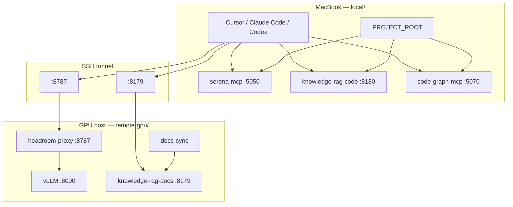

# Hyper Agent — Local + Remote GPU Stack

Docker Compose setup for coding agents (Cursor, Claude Code, Codex) with **inference on a GPU host** and **code-aware MCP tools on your MacBook**.

Your source code stays on the Mac. The GPU machine runs the LLM, Headroom compression proxy, and a searchable index of **public documentation**. Your Mac runs MCP servers that need direct filesystem access.

## Architecture



**Design principle:** GPU for compute, Mac for filesystem.

## Repository layout

```
hyper-agent/
├── README.md                 ← you are here
├── local/                    ← run on MacBook (MCP + code indexes)
│   ├── README.md
│   ├── docker-compose.yaml
│   ├── serena-mcp/
│   ├── code-graph-mcp/
│   └── knowledge-rag-code/
└── remote-gpu/               ← run on Linux GPU host (LLM + docs)
    ├── README.md
    ├── docker-compose.yaml
    ├── headroom/
    └── knowledge-rag-docs/
```

## Quick start

### 1. GPU host

```bash
cd remote-gpu
cp .env.example .env
docker compose up -d --build
```

See [remote-gpu/README.md](remote-gpu/README.md) for details, ports, and troubleshooting.

### 2. MacBook

```bash
cd local
cp .env.example .env
# Edit PROJECT_ROOT
docker compose up -d --build
```

See [local/README.md](local/README.md) for serena multi-project setup and MCP config.

### 3. SSH tunnel (Mac → GPU)

```bash
ssh -N \
  -L 8787:127.0.0.1:8787 \
  -L 8179:127.0.0.1:8179 \
  -L 8000:127.0.0.1:8000 \
  user@gpu-host
```

### 3b. Codex on Mac (`~/.codex/config.toml`)

```bash
cd remote-gpu
cp codex.config.example.toml ~/.codex/config.toml
cp codex.hyper-agent.config.example.toml ~/.codex/hyper-agent.config.toml
export OPENAI_API_KEY=dummy
codex --profile hyper-agent
```

See [remote-gpu/README.md](remote-gpu/README.md) for `model_provider`, permissions, and troubleshooting raw `<tool_call>` output.

### 4. Cursor MCP

```json
{
  "mcpServers": {
    "serena": { "url": "http://127.0.0.1:5050/sse" },
    "code-graph": { "url": "http://127.0.0.1:5070/sse" },
    "knowledge-rag-code": { "url": "http://127.0.0.1:8180/sse" },
    "knowledge-rag-docs": { "url": "http://127.0.0.1:8179/sse" }
  }
}
```

`knowledge-rag-docs` requires the SSH tunnel. The other three are fully local.

## What runs where

| Component | Host | Port | Folder |
|-----------|------|------|--------|
| vLLM | GPU | 8000 | `remote-gpu/` |
| Headroom proxy | GPU | 8787 | `remote-gpu/` |
| knowledge-rag-docs | GPU | 8179 | `remote-gpu/` |
| serena-mcp | Mac | 5050 | `local/` |
| code-graph-mcp | Mac | 5070 | `local/` |
| knowledge-rag-code | Mac | 8180 | `local/` |

## End-to-end smoke test

```bash
# Mac — containers stable
cd local && docker compose ps

# Mac — MCP ports
curl -s -o /dev/null -w "serena: %{http_code}\n" --max-time 3 http://127.0.0.1:5050/sse

# GPU via tunnel
curl -s http://127.0.0.1:8787/livez
```

In Cursor, confirm all four MCP servers show connected, then ask the agent to search your repo (`knowledge-rag-code`) and look up a library doc (`knowledge-rag-docs`).

## Further reading

- [local/README.md](local/README.md) — Mac MCP services, PROJECT_ROOT, troubleshooting
- [remote-gpu/README.md](remote-gpu/README.md) — vLLM, Headroom, doc sync, LLM client env vars
