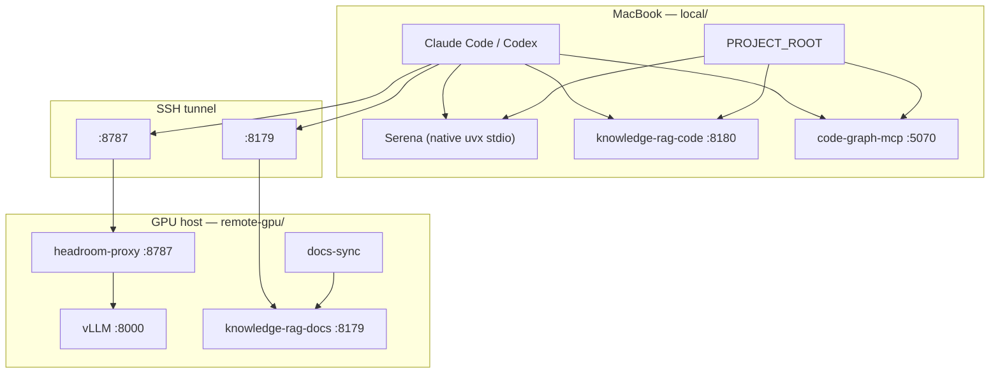

# Agent — Local + Remote GPU Stack

Docker Compose setup for coding agents (Claude Code, Codex) with **inference on a GPU host** and **code-aware MCP tools on your MacBook**.

Your source code stays on the Mac. The GPU machine runs the LLM, Headroom compression proxy, and a searchable index of **public documentation**. Your Mac runs MCP servers that need direct filesystem access.

## Architecture



**Design principle:** GPU for compute, Mac for filesystem.

## Repository layout

```
agent/
├── README.md                 ← you are here
├── local/                    ← run on MacBook (MCP + code indexes)
│   ├── README.md
│   ├── docker-compose.yaml
│   ├── code-graph-mcp/
│   └── knowledge-rag-code/
└── remote-gpu/               ← run on Linux GPU host (LLM + docs)
    ├── README.md
    ├── docker-compose.yaml
    ├── headroom/
    └── knowledge-rag-docs/
```

## Quick start

### 1. GPU host

```bash
cd remote-gpu
cp .env.example .env
docker compose up -d --build
```

See [remote-gpu/README.md](remote-gpu/README.md) for details, ports, and troubleshooting.

### 2. MacBook

```bash
cd local
cp .env.example .env
# Edit PROJECT_ROOT
docker compose up -d --build
```

See [local/README.md](local/README.md) for Serena (native uvx) and [remote-gpu/README.md](remote-gpu/README.md) for LLM provider settings.

### 3. SSH tunnel (Mac → GPU)

```bash
ssh -N \
  -L 8787:127.0.0.1:8787 \
  -L 8179:127.0.0.1:8179 \
  -L 8000:127.0.0.1:8000 \
  user@gpu-host
```

### 3b. Codex on Mac (`~/.codex/config.toml`)

```bash
cd remote-gpu
cp codex.config.example.toml ~/.codex/config.toml
cp codex.hyper-agent.config.example.toml ~/.codex/hyper-agent.config.toml
export OPENAI_API_KEY=dummy
codex --profile hyper-agent
```

See [remote-gpu/README.md](remote-gpu/README.md) for `model_provider`, permissions, and troubleshooting raw `<tool_call>` output.

### 4. Claude Code

Assumes remote-gpu is running on the GPU host and SSH port forwarding is active on this machine:

```bash
ssh -N -L 8787:127.0.0.1:8787 -L 8179:127.0.0.1:8179 -L 8000:127.0.0.1:8000 user@gpu-host
bash local/scripts/setup-claude-mcp.sh   # writes ~/.claude/settings.json
cd /path/to/agent && claude
```

Register MCP servers in `~/.claude.json` separately (`claude mcp add ... -s user`). Serena hooks: `.claude/settings.json`.

## What runs where

| Component | Host | Port | Folder |
|-----------|------|------|--------|
| vLLM | GPU | 8000 | `remote-gpu/` |
| Headroom proxy | GPU | 8787 | `remote-gpu/` |
| knowledge-rag-docs | GPU | 8179 | `remote-gpu/` |
| serena | Mac | — | native `uvx` stdio — see `local/codex.serena.example.toml` |
| code-graph-mcp | Mac | 5070 | `local/` |
| knowledge-rag-code | Mac | 8180 | `local/` |

## End-to-end smoke test

```bash
# Mac — containers stable
cd local && docker compose ps

# Mac — MCP ports (Docker services; Serena for Codex is native stdio)
python3 -c "import socket; socket.create_connection(('127.0.0.1',8180),2).close(); print('knowledge-rag-code: ok')"

# GPU via tunnel
curl -s http://127.0.0.1:8787/livez
curl -s http://127.0.0.1:8000/v1/models
```

Ask the agent to search your repo (`knowledge-rag-code`) and look up a library doc (`knowledge-rag-docs`).

## Further reading

- [local/README.md](local/README.md) — Mac MCP services, PROJECT_ROOT, troubleshooting
- [remote-gpu/README.md](remote-gpu/README.md) — vLLM, Headroom, doc sync, LLM client env vars
