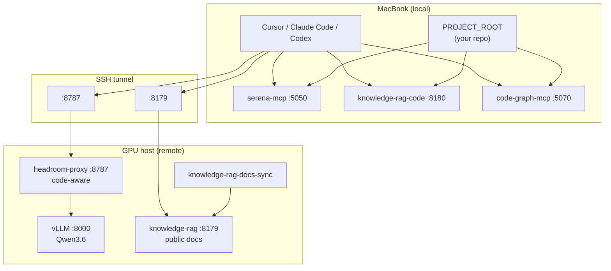

# AI Agent Stack — Split Local + Remote

Docker Compose setup for coding agents (Cursor, Claude Code, Codex) with **inference on a GPU host** and **code-aware tools on your MacBook**.

Your source code stays on the Mac. The GPU machine runs the LLM, Headroom compression proxy, and a searchable index of **public documentation**. Your Mac runs MCP servers that need direct filesystem access: symbol navigation (Serena), call-graph intelligence (code-graph), and semantic search over your repo (knowledge-rag).

---

## Architecture



### What runs where

| Component | Host | Port | Purpose |
|-----------|------|------|---------|
| **vLLM** | GPU | 8000 | OpenAI-compatible LLM (Qwen3.6-35B-A3B-FP8) |
| **Headroom proxy** | GPU | 8787 | Routes LLM traffic; **code-aware** AST compression on message bodies |
| **knowledge-rag** (docs) | GPU | 8179 | Semantic search over fetched public docs (Docker, K8s, React, …) |
| **knowledge-rag-docs-sync** | GPU | — | Downloads docs from manifest; triggers re-index |
| **serena-mcp** | Mac | 5050 | Symbol-aware code tools (definitions, references, edits) |
| **knowledge-rag-code** | Mac | 8180 | Semantic search over **your** `PROJECT_ROOT`; auto re-index on save |
| **code-graph-mcp** | Mac | 5070 | Call-graph / structure intelligence (codebase-memory-mcp) |

### Design principle

**GPU for compute, Mac for filesystem.**

- Anything that reads your working tree → local.
- Anything that needs an NVIDIA GPU → remote.
- Headroom **code-aware** compresses code *in transit* (inside LLM messages), so it does not need your repo mounted on the GPU host.

---

## Repository layout

```
agent/
├── docker-compose.yaml          # Default: includes remote stack (GPU host)
├── docker-compose.remote.yaml   # GPU: vLLM, Headroom, knowledge-rag (docs)
├── docker-compose.local.yaml    # Mac: serena-mcp, code-graph-mcp, knowledge-rag-code
├── code-graph-mcp/
│   ├── Dockerfile               # codebase-memory-mcp + supergateway (SSE :5070)
│   └── data/                    # Graph index cache (MacBook)
├── .env.example                 # MacBook: PROJECT_ROOT (copy to .env)
├── .gitignore                   # Ignores indexes, downloaded docs, .env
├── headroom/
│   └── Dockerfile               # headroom-vllm image (code-aware + vLLM tools patch)
└── knowledge-rag/
    ├── Dockerfile               # knowledge-rag[server] 4.3.1 (multi-arch)
    ├── config.yaml              # Remote docs index (:8179)
    ├── config.local.yaml        # Local code index (:8180)
    ├── fetch-docs-manifest.tsv  # URLs to download for doc index
    ├── fetch-docs.sh            # Downloader (runs in docs-sync container)
    ├── documents/               # Downloaded public docs (GPU host)
    ├── data/                    # Doc index vectors (GPU host)
    └── local-code-data/         # Code index vectors (MacBook)
```

### Generated data (not committed)

Runtime indexes and downloaded docs are **gitignored** and rebuilt locally. Only config, manifests, and `.gitkeep` placeholders are tracked.

| Path | Host | Contents |
|------|------|----------|
| `knowledge-rag/documents/` | GPU | Fetched public docs (from `fetch-docs-manifest.tsv`) |
| `knowledge-rag/data/` | GPU | Doc vector index + embedding model cache |
| `knowledge-rag/local-code-data/` | Mac | Semantic index of `PROJECT_ROOT` |
| `code-graph-mcp/data/` | Mac | Structure graph cache for `PROJECT_ROOT` |
| `.env` | Mac | Your `PROJECT_ROOT` path |

To wipe and rebuild an index, stop the service, delete the contents of the data directory (keep `.gitkeep`), and start again.

---

## Prerequisites

### GPU host

- Linux with NVIDIA GPU and drivers
- [Docker Compose v2](https://docs.docker.com/compose/) with NVIDIA Container Toolkit
- Enough VRAM for Qwen3.6-35B-A3B-FP8 (adjust model / `--gpu-memory-utilization` in compose if needed)
- Hugging Face cache at `~/.cache/huggingface` (mounted into vLLM)

### MacBook

- Docker Desktop (or Docker Engine)
- Your project checked out locally
- SSH access to the GPU host

---

## Quick start

### 1. Start the GPU stack

On the **GPU host**, from this repo:

```bash
docker compose up -d --build
# equivalent:
docker compose -f docker-compose.remote.yaml up -d --build
```

First startup can take several minutes while vLLM loads the model. Check status:

```bash
docker compose ps
docker logs -f vllm-qwen3.6    # wait for "Application startup complete"
docker logs headroom-ai        # should show Code-Aware: ENABLED
```

**Remote ports**

| Port | Service |
|------|---------|
| 8000 | vLLM (direct; bypasses Headroom) |
| 8787 | Headroom proxy |
| 8179 | knowledge-rag (public docs MCP) |

Optional: change doc refresh interval (default 24h):

```bash
# .env on GPU host
DOCS_SYNC_INTERVAL_SECONDS=86400
```

### 2. Start the Mac stack

On your **MacBook**:

```bash
cp .env.example .env
```

Edit `.env`:

```bash
PROJECT_ROOT=/Users/you/path/to/your/project
```

Start local MCP services:

```bash
docker compose -f docker-compose.local.yaml up -d --build
```

First index of a large repo may take several minutes on CPU. The file watcher re-indexes changed files automatically (~5s debounce).

**Local ports**

| Port | Service |
|------|---------|
| 5050 | serena-mcp |
| 5070 | code-graph-mcp |
| 8180 | knowledge-rag-code |

### 3. Open SSH tunnel

From the MacBook, forward remote Headroom and doc RAG:

```bash
ssh -N \
  -L 8787:127.0.0.1:8787 \
  -L 8179:127.0.0.1:8179 \
  user@gpu-host
```

Keep this session open while coding. Add to `~/.ssh/config` for convenience:

```
Host gpu-agent
  HostName gpu-host.example.com
  User your-user
  LocalForward 8787 127.0.0.1:8787
  LocalForward 8179 127.0.0.1:8179
```

Then: `ssh -N gpu-agent`

---

## Configure MCP clients (Cursor)

In **Cursor Settings → MCP**, add SSE servers:

```json
{
  "mcpServers": {
    "serena": {
      "url": "http://127.0.0.1:5050/sse"
    },
    "code-graph": {
      "url": "http://127.0.0.1:5070/sse"
    },
    "knowledge-rag-code": {
      "url": "http://127.0.0.1:8180/sse"
    },
    "knowledge-rag-docs": {
      "url": "http://127.0.0.1:8179/sse"
    }
  }
}
```

| MCP | When to use |
|-----|-------------|
| **serena** | Navigate symbols, find definitions, structured edits |
| **code-graph** | Call chains, impact analysis, structural graph queries |
| **knowledge-rag-code** | “How does our codebase handle X?” — semantic search over your repo |
| **knowledge-rag-docs** | “What does the Kubernetes / FFmpeg / React API say?” — public docs |

`knowledge-rag-docs` requires the SSH tunnel to the GPU host. The other three MCP servers are fully local.

---

## Configure LLM clients

Headroom on `:8787` is a **single entry point** that routes by API shape:

| Client | Environment | Headroom route | Upstream |
|--------|-------------|----------------|----------|
| **Codex / OpenAI SDK** | `OPENAI_BASE_URL=http://127.0.0.1:8787/v1` | `/v1/chat/completions` | Local **vLLM** (Qwen) |
| **Claude Code** | `ANTHROPIC_BASE_URL=http://127.0.0.1:8787` | `/v1/messages` | **Anthropic cloud** |

### Codex (local Qwen via Headroom)

```bash
export OPENAI_BASE_URL=http://127.0.0.1:8787/v1
export OPENAI_API_KEY=dummy   # vLLM does not validate keys
codex
```

### Claude Code (Anthropic cloud via Headroom compression)

Headroom compresses prompts/responses; inference still uses Anthropic’s API. You need a real Anthropic API key or OAuth login — it does **not** route Claude to local Qwen.

```bash
export ANTHROPIC_BASE_URL=http://127.0.0.1:8787
export ENABLE_TOOL_SEARCH=true
claude
```

### Direct vLLM (no Headroom)

Useful for debugging or clients that send empty `tools` arrays Headroom might touch:

```bash
export OPENAI_BASE_URL=http://127.0.0.1:8000/v1   # tunnel -L 8000:... if remote
```

---

## Headroom: code-aware vs code-graph

These are different features.

### code-aware (remote — already enabled)

Configured in `docker-compose.remote.yaml`:

- `--code-aware` + `HEADROOM_CODE_AWARE_ENABLED=1`
- Custom image installs `headroom-ai[code]` for AST-based compression
- Applies to code **inside LLM message bodies** (tool output, pasted snippets) as traffic passes through `:8787`
- **No Mac setup required** — use the tunneled Headroom URL

Verify in logs:

```bash
docker logs headroom-ai 2>&1 | head -30
```

### code-graph (local — Docker)

The **`code-graph-mcp`** service indexes `PROJECT_ROOT` via [codebase-memory-mcp](https://github.com/DeusData/codebase-memory-mcp) and exposes it on **`http://127.0.0.1:5070/sse`**. This is the same engine Headroom uses with `--code-graph`.

- Starts automatically with `docker compose -f docker-compose.local.yaml up -d`
- Initial fast index on startup; background watcher re-indexes on file changes
- Graph cache persisted in `code-graph-mcp/data/`

**Claude Code native wrap (optional)** — registers MCP in `claude mcp` instead of Cursor:

```bash
pip install "headroom-ai[code]"
cd "$PROJECT_ROOT"
headroom wrap claude --code-graph --no-proxy --no-serena
```

Use `--no-serena` because serena-mcp already runs in Docker on `:5050`.

---

## knowledge-rag: docs vs code

Both use the same [knowledge-rag](https://github.com/lyonzin/knowledge-rag) server with different configs.

### Public docs (GPU, `:8179`)

1. `knowledge-rag-docs-sync` downloads URLs from `knowledge-rag/fetch-docs-manifest.tsv`
2. Files land in `knowledge-rag/documents/<category>/`
3. `knowledge-rag` watches the directory and re-indexes on change
4. Index persisted in `knowledge-rag/data/`

**Add a doc source** — append a row to the manifest:

```tsv
# category<TAB>url<TAB>filename
mylib	https://example.com/llms.txt	llms.txt
```

Then restart sync or wait for the next scheduled fetch. Prefer `llms.txt` over huge `llms-full.txt` when available (faster indexing, less disk).

Categories map to search hints in `knowledge-rag/config.yaml` under `category_mappings`.

### Your source code (Mac, `:8180`)

1. `PROJECT_ROOT` is mounted read-only at `/app/documents`
2. `config.local.yaml` defines supported extensions and exclude patterns (`node_modules`, `.git`, build dirs, …)
3. Index persisted in `knowledge-rag/local-code-data/`
4. File watcher re-indexes after saves

To re-index from scratch:

```bash
docker compose -f docker-compose.local.yaml stop knowledge-rag-code
rm -rf knowledge-rag/local-code-data/*
docker compose -f docker-compose.local.yaml up -d knowledge-rag-code
```

### Structure graph (Mac, `:5070`)

1. `PROJECT_ROOT` is mounted read-only at `/workspace`
2. Fast index runs on container start; codebase-memory-mcp watches for file changes
3. Graph cache persisted in `code-graph-mcp/data/` (gitignored)

To re-index from scratch:

```bash
docker compose -f docker-compose.local.yaml stop code-graph-mcp
rm -rf code-graph-mcp/data/*
docker compose -f docker-compose.local.yaml up -d code-graph-mcp
```

---

## End-to-end workflow

Typical session:

1. **GPU host** — `docker compose up -d` (once, or after updates)
2. **Mac** — `docker compose -f docker-compose.local.yaml up -d`
3. **Mac** — `ssh -N` tunnel (`8787`, `8179`)
4. **Cursor** — MCP servers connected; agent can:
   - Read/edit code via Serena
   - Query call chains / structure via code-graph
   - Search your repo semantically via knowledge-rag-code
   - Look up library docs via knowledge-rag-docs
5. **LLM** — Codex uses local Qwen through Headroom; Claude Code uses Anthropic through Headroom with compression

```text
You ask: "How do we handle WebRTC ICE in our app, and what does the spec say?"

  → knowledge-rag-code   searches PROJECT_ROOT (semantic chunks)
  → knowledge-rag-docs   searches webrtc / security-protocols docs
  → code-graph           traces call chains / related symbols
  → serena               finds definitions / applies edits
  → Headroom             compresses large code blocks in the LLM context
  → vLLM or Anthropic    generates the answer
```

---

## Customization

### Change the LLM model

Edit `docker-compose.remote.yaml` → `vllm-backend.command`:

```yaml
command: >
  serve YOUR/MODEL-ID
  --port 8000
  --tensor-parallel-size 1
  --gpu-memory-utilization 0.5
```

Rebuild/restart vLLM and ensure Headroom stays healthy after vLLM is up.

### Headroom image

`headroom/Dockerfile` extends the upstream Headroom image with:

- `headroom-ai[code]` for code-aware compression
- A patch so Headroom does not send empty `tools: []` to vLLM (vLLM rejects empty tool arrays)

Rebuild after changes:

```bash
docker compose build headroom-proxy
docker compose up -d headroom-proxy
```

### Exclude paths from local code index

Edit `knowledge-rag/config.local.yaml` → `documents.exclude_patterns`.

### Index multiple local projects

Run a second compose override with a different `PROJECT_ROOT`, port, and data directory — or point `PROJECT_ROOT` at a monorepo parent.

---

## Troubleshooting

### vLLM not healthy / exit 137

Usually OOM. Lower `--gpu-memory-utilization`, use a smaller model, or increase available GPU memory.

```bash
docker logs vllm-qwen3.6
```

### Headroom unhealthy

Headroom waits for vLLM. Start order: vLLM healthy → Headroom.

```bash
curl -s http://127.0.0.1:8787/livez
curl -s http://127.0.0.1:8000/v1/models
```

### MCP connection refused on Mac

```bash
docker compose -f docker-compose.local.yaml ps
curl -s -o /dev/null -w "%{http_code}" http://127.0.0.1:5050/sse
curl -s -o /dev/null -w "%{http_code}" http://127.0.0.1:5070/sse
curl -s -o /dev/null -w "%{http_code}" http://127.0.0.1:8180/sse
```

Ensure `PROJECT_ROOT` is set in `.env` (copy from `.env.example`) and the path exists.

### knowledge-rag-docs unreachable

Tunnel must be active:

```bash
curl -s -o /dev/null -w "%{http_code}" http://127.0.0.1:8179/sse
```

On GPU host:

```bash
docker logs knowledge-rag
docker logs knowledge-rag-docs-sync
```

Initial doc indexing can take several minutes (`start_period: 180s` in healthcheck).

### Empty tools error on vLLM via Headroom

The custom `headroom-vllm` image includes a PRE_SEND patch. Rebuild:

```bash
docker compose build headroom-proxy --no-cache
docker compose up -d headroom-proxy
```

Or bypass Headroom and hit vLLM on `:8000` directly.

### Slow first code index on Mac

Expected for large repos — embeddings run on CPU inside the container. Subsequent updates are incremental via the file watcher.

### Orphan containers after migration

If old services (context7-mcp, embedding-server, local-faiss-mcp) still run:

```bash
docker compose down --remove-orphans
docker compose -f docker-compose.local.yaml down --remove-orphans
```

---

## Maintenance

```bash
# GPU — restart full stack
docker compose -f docker-compose.remote.yaml up -d --build

# GPU — refresh docs now (inside sync container)
docker compose exec knowledge-rag-docs-sync /fetch-docs.sh

# GPU — wipe doc index and rebuild (keeps .gitkeep)
docker compose stop knowledge-rag
rm -rf knowledge-rag/data/*
docker compose up -d knowledge-rag

# Mac — restart local MCP
docker compose -f docker-compose.local.yaml up -d --build

# View logs
docker compose logs -f headroom-proxy knowledge-rag
docker compose -f docker-compose.local.yaml logs -f serena-mcp code-graph-mcp knowledge-rag-code

# Stop everything
docker compose down
docker compose -f docker-compose.local.yaml down
```

---

## Summary

| Need | Solution |
|------|----------|
| Local LLM (Qwen) | SSH tunnel → Headroom `:8787` → vLLM; set `OPENAI_BASE_URL` |
| Claude with compression | SSH tunnel → Headroom `:8787`; set `ANTHROPIC_BASE_URL` |
| Symbol / edit tools | serena-mcp `:5050` on Mac |
| Search your codebase | knowledge-rag-code `:8180` on Mac (`PROJECT_ROOT`) |
| Search library docs offline | knowledge-rag `:8179` on GPU (via tunnel) |
| Compress code in LLM context | Headroom code-aware on GPU (automatic via tunnel) |
| Call-graph / structure memory | code-graph-mcp `:5070` (or `headroom wrap --code-graph --no-proxy` for Claude Code) |
